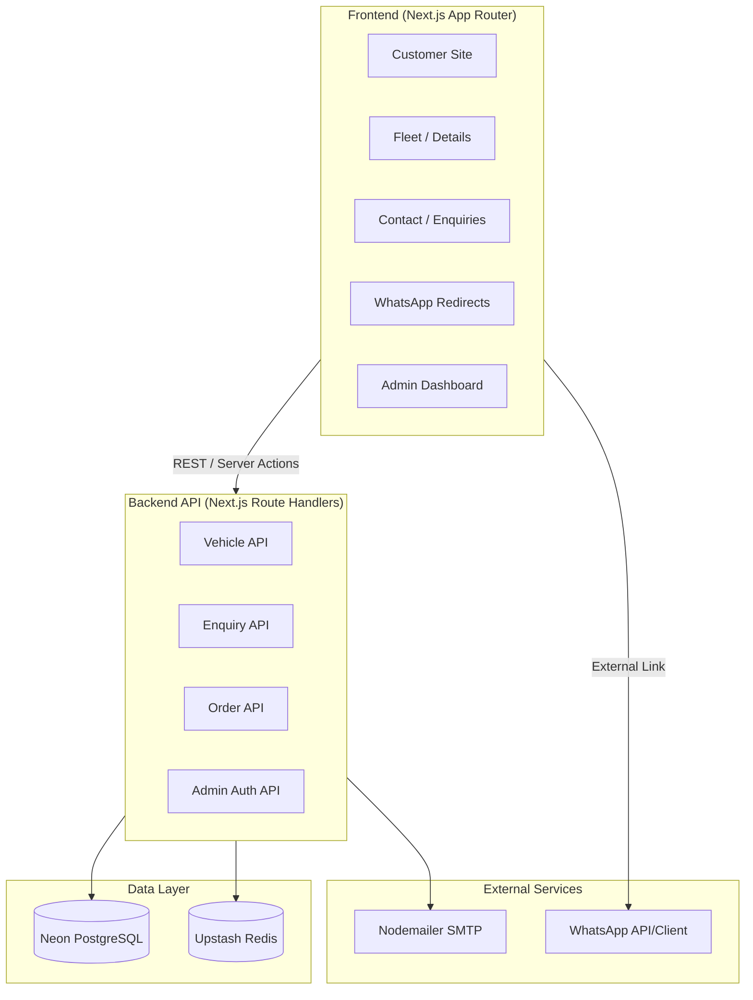
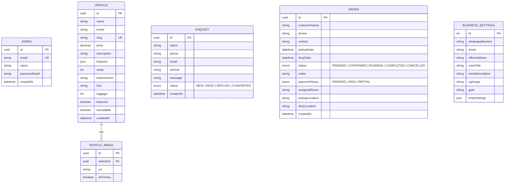
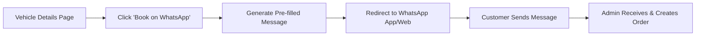
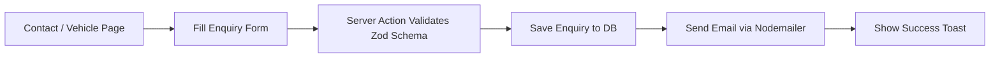
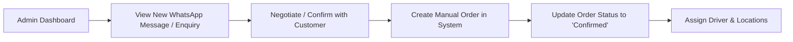

# Architecture — DOORA MOBILITY Platform

> Derived from [context.md](file:///Users/iamprince/Desktop/doora%20car%20rental/docs/context.md)

---

## 1. Overview

**DOORA MOBILITY** is a premium, enterprise-grade car rental management platform designed as a SaaS-style application. It features a luxury public-facing customer website optimized for SEO and performance, paired with a secure admin dashboard for managing fleet, enquiries, and orders. Instead of an automated checkout process, it provides a white-glove, high-touch booking experience where reservations are initiated via WhatsApp or email, and subsequently managed manually by admins.

---

## 2. High-Level Architecture



---

## 3. Tech Stack

| Layer | Technology | Rationale |
|---|---|---|
| **Framework** | Next.js 15 (App Router) | Server Components, SEO optimization, ISR |
| **Language** | TypeScript | Full-stack type safety |
| **UI & Styling** | Tailwind CSS, Shadcn UI | Utility-first, accessible, premium design system |
| **Animations** | Framer Motion | Fluid, cinematic micro-interactions (page transitions, hover lifts) |
| **Database** | Neon PostgreSQL | Serverless, scalable relational database |
| **ORM** | Prisma | Schema management, migrations, type-safe queries |
| **Caching & Rate Limit** | Upstash Redis | API rate limiting and edge caching |
| **Auth** | NextAuth.js (Auth.js) | JWT session management for Admin |
| **Forms & Validation**| React Hook Form, Zod | Client and server-side validation |
| **Email** | Nodemailer | Sending enquiry confirmations via custom SMTP |
| **Image Optimization**| Sharp | High-performance image processing |

---

## 4. Project Structure

```text
doora-mobility/
├── docs/                          # Documentation
│   ├── context.md
│   └── architecture.md
├── public/                        # Static assets (Logos, icons)
├── src/
│   ├── app/                       # Next.js App Router
│   │   ├── (customer)/            # Public Pages (No Auth)
│   │   │   ├── page.tsx           # Home page
│   │   │   ├── fleet/page.tsx     # Fleet grid
│   │   │   ├── vehicle/
│   │   │   │   └── [slug]/page.tsx# Vehicle details
│   │   │   ├── about/page.tsx
│   │   │   ├── contact/page.tsx
│   │   │   └── faq/page.tsx
│   │   ├── admin/                 # Secure Admin Pages
│   │   │   ├── dashboard/page.tsx
│   │   │   ├── vehicles/page.tsx
│   │   │   ├── enquiries/page.tsx
│   │   │   ├── orders/page.tsx
│   │   │   ├── settings/page.tsx
│   │   │   └── login/page.tsx
│   │   ├── api/                   # Route Handlers
│   │   │   ├── vehicles/route.ts
│   │   │   ├── enquiries/route.ts
│   │   │   └── orders/route.ts
│   │   └── middleware.ts          # Edge middleware (Auth & Rate limiting)
│   ├── actions/                   # Next.js Server Actions
│   ├── components/                # React Components
│   │   ├── ui/                    # Shadcn primitives
│   │   ├── customer/              # Customer-facing blocks (Hero, Navbar)
│   │   └── admin/                 # Admin dashboard blocks (Sidebar, Charts)
│   ├── lib/                       # Utility clients (Prisma, Redis, Nodemailer)
│   ├── hooks/                     # Custom React Hooks
│   ├── prisma/                    # Schema and Migrations
│   ├── schemas/                   # Zod validation schemas
│   ├── types/                     # Shared TypeScript types
│   └── emails/                    # Email templates
```

---

## 5. Data Model



---

## 6. Core User Flows

### 6.1 WhatsApp Booking Flow (Customer)



### 6.2 Enquiry Flow (Customer)



### 6.3 Order Management (Admin)



---

## 7. Design & UI/UX Goal

The design system enforces a **premium automotive SaaS** aesthetic mimicking brands like Tesla, Audi, and SIXT.

- **Theme Colors:** Deep Black (`#111111`), Premium Red (`#E31B23`), Crisp White (`#FFFFFF`).
- **Typography:** Space Grotesk (Headings), Inter (Body), Manrope (Buttons).
- **Animations:** High-end motion design via Framer Motion (lazy-loaded cinematic road animations, soft card elevations, page transitions).
- **SEO & Performance:** Heavily relies on React Server Components, ISR (Incremental Static Regeneration) for the fleet pages, lazy-loaded images (`next/image` + Sharp), and dynamic JSON-LD metadata for optimal Core Web Vitals.
